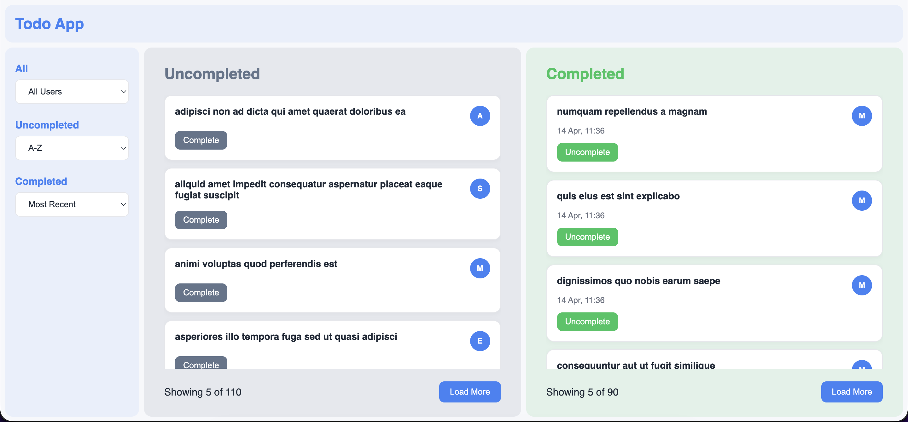

# Todo App

This project is a React application built with Vite, TypeScript, and Sass.

## Preview of the app



## Live demo

https://dss-task-vozo-e1q2t7ejk-marto113s-projects.vercel.app/

## Prerequisites

Before running the app locally, make sure you have:

- Node.js 20 or newer
- npm 10 or newer

You can verify your installed versions with:

```bash
node -v
npm -v
```

## Tech Stack

- React
- TypeScript
- Sass


## Install Dependencies

Install all required packages with:

```bash
npm install
```

## Run The App Locally

Start the development server with:

```bash
npm run dev
```

After the server starts, open the local URL shown in the terminal.

```bash
http://localhost:5173
```

## Available Scripts

Run the development server:

```bash
npm run dev
```

Create a production build:

```bash
npm run build
```

Preview the production build locally:

```bash
npm run preview
```

Run linting:

```bash
npm run lint
```

Format the project with Prettier:

```bash
npm run format
```

Check whether files match the Prettier rules:

```bash
npm run format:check
```

## Project Setup Notes

- This project uses Vite as the local development server and build tool.
- Styles are written in SCSS, so the `sass` package must be installed, which is already included in `package.json`.
- No additional environment variables or external configuration files are required to run the app locally based on the current project setup.
- Prettier is configured through `.prettierrc.json`.


## Folder Overview

- `src/` contains the application source code
- `public/` contains static assets
- `src/styles/` contains the SCSS files
